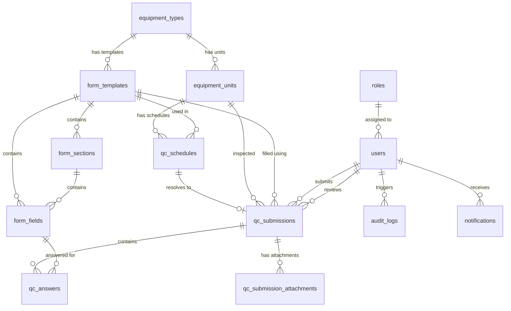

# Dokumentasi Sistem MediQC

MediQC adalah sistem manajemen Quality Control (QC) untuk peralatan medis (seperti mesin X-Ray, CT Scan, dll.) di rumah sakit. Sistem ini memfasilitasi pembuatan formulir dinamis, penjadwalan inspeksi rutin, pengisian hasil pemeriksaan, evaluasi kepatuhan otomatis (sistem peringatan), serta alur peninjauan (review) hasil oleh pihak berwenang.

Sistem dibangun menggunakan stack modern:
- **Backend:** Laravel (PHP) dengan arsitektur Service-Repository yang rapi.
- **Frontend:** Vue 3 dengan Inertia.js (tanpa reload halaman) dan TailwindCSS untuk antarmuka yang modern dan responsif.
- **Database:** PostgreSQL/MySQL dengan pemanfaatan relasi terstruktur dan kolom JSON untuk fleksibilitas tinggi.

---

## 1. Arsitektur Database & Hubungan Entitas (ERD)

Berikut adalah diagram relasi antarentitas dalam sistem MediQC yang digambarkan menggunakan diagram Mermaid:

### Penjelasan Tabel Utama:
1. **`roles` & `users`**: Menyimpan pengguna dan peran mereka (Admin, Radiografer, Fisikawan Medis, Elektromedis) beserta JSON permission. Pengguna menggunakan UUID sebagai primary key (`HasUuids`).
2. **`equipment_types`**: Tipe alat medis, seperti `XRAY` (X-Ray Konvensional).
3. **`equipment_units`**: Unit fisik dari alat medis spesifik (misalnya: Unit X-Ray di Ruang Melati). Menyimpan kode aset, nomor seri, ruangan, dan masa aktif kalibrasi.
4. **`form_templates`**: Template formulir inspeksi QC. Dikelola oleh Admin dan terikat ke `equipment_type_id` serta tipe QC (`harian`, `bulanan`, `tahunan`).
5. **`form_sections` & `form_fields`**: Pembentuk formulir dinamis. Field mendukung berbagai jenis input (`FieldType`) seperti decimal, radio, signature, table, dan file_upload. Field juga mendukung relasi parent-child untuk kondisi kondisional.
6. **`qc_schedules`**: Jadwal pemeriksaan QC yang otomatis di-generate berdasarkan unit aktif dan template yang dirilis.
7. **`qc_submissions`**: Rekaman hasil pengisian QC oleh operator/user.
8. **`qc_answers`**: Rekaman jawaban untuk setiap field. Nilai disimpan di kolom yang sesuai dengan tipe datanya (misal: angka desimal di `value_numeric`, boolean di `value_boolean`, json di `value_json`) guna efisiensi query dan validasi data.

---

## 2. Alur Kerja Utama Sistem (Core Workflows)

### A. Pembuatan Formulir Dinamis (Dynamic Form Engine)
Formulir tidak didefinisikan secara statis di kode, melainkan dikonfigurasi melalui database. Setiap `FormField` memiliki properti penting:
- **`field_type`**: Ditentukan oleh [FieldType.php](file:///app/Enums/FieldType.php). Menentukan input visual di frontend dan menentukan kolom penyimpanan nilai di database (`valueColumn()`).
- **`show_when`**: Konfigurasi JSON yang diolah oleh [ConditionalEvaluator.php](file:///app/Services/ConditionalEvaluator.php). Mendukung logika visibilitas dinamis (misalnya: field **"Jelaskan Kerusakan"** hanya tampil jika pilihan pada field parent **"Apakah ada kerusakan?"** bernilai `"yes"`).

### B. Otomatisasi Jadwal QC (Scheduling System)
Dikelola oleh [ScheduleService.php](file:///app/Services/ScheduleService.php):
- Jadwal di-generate berkala (`generateForPeriod`) sesuai tipe periode (harian, bulanan, tahunan).
- Sistem memetakan seluruh `EquipmentUnit` aktif ke `FormTemplate` terbaru yang terbit (`is_published = true`).
- Jadwal yang melewati batas tanggal tanpa penyelesaian akan ditandai dengan status `overdue` melalui metode `markOverdue()`.

### C. Engine Evaluasi Peringatan (Warning Engine)
Setiap field dapat dikonfigurasi dengan aturan peringatan (`warning_rules`) berupa JSON. Saat pengisian QC dikirimkan (disubmit), [WarningEvaluator.php](file:///app/Services/WarningEvaluator.php) mengevaluasi masukan secara real-time:
- **`warning_below` / `warning_above`**: Memicu peringatan jika nilai numerik berada di luar batas aman (misal hasil uji kVp di luar 70–90 kVp).
- **`warning_if_value` / `warning_if_value_in`**: Memicu peringatan jika opsi yang dipilih adalah nilai terlarang/kondisi bermasalah (misalnya kondisi visual bernilai `"trouble"`).
- **`warning_if_past_due`**: Memicu peringatan jika tanggal yang dimasukkan sudah terlampaui (misal tenggat kalibrasi sudah lewat).
- **`warning_if_empty`**: Memastikan data terisi jika kolom tersebut diwajibkan.

Jika ada aturan yang terpicu, `QcAnswer` akan disimpan dengan bendera `has_warning = true` beserta deskripsi alasan di kolom `warning_message`. Akumulasi peringatan disimpan di `qc_submissions.warning_count`, dan status submission berubah menjadi **`needs_action`** (Memerlukan Tindakan/Tindak Lanjut).

### D. Alur Peninjauan & Persetujuan (Review & Approval Workflow)
- **Draft & Submit**: Pengguna dapat menyimpan draf terlebih dahulu (`submit = false`, status `draft`) atau langsung melakukan pengiriman akhir (`submit = true`, status `submitted` atau `needs_action` tergantung warning).
- **Review**: Pihak dengan izin `qc.review` (seperti *Fisikawan Medis* atau *Admin*) meninjau hasil pemeriksaan. Hasil tinjauan dapat disetujui (*Approved*) atau ditolak (*Rejected*) disertai dengan catatan tinjauan (`review_notes`).
- **Audit Log**: Setiap tindakan penyimpanan draf, submisi final, persetujuan, dan penolakan dicatat dalam tabel `audit_logs` secara otomatis melalui metode static `AuditLog::record()`.

---

## 3. Matriks Peran & Hak Akses (Role & Permission Matrix)

Sistem menggunakan kontrol hak akses berbasis peran (RBAC). Detail otorisasi disimpan dalam tabel `roles` pada kolom JSON `permissions`. Berdasarkan konfigurasi di [RoleSeeder.php](file:///database/seeders/RoleSeeder.php), berikut matriks hak aksesnya:

| Fitur / Modul | Administrator (`admin`) | Radiografer (`radiografer`) | Fisikawan Medis (`fisikawan_medis`) | Elektromedis (`elektromedis`) |
| :--- | :---: | :---: | :---: | :---: |
| **Mengisi QC Harian** | Ya | Ya | Tidak | Tidak |
| **Mengisi QC Bulanan** | Ya | Tidak | Ya | Ya |
| **Mengisi QC Tahunan** | Ya | Tidak | Ya | Tidak |
| **Melihat QC Milik Sendiri** | Ya | Ya | Ya | Ya |
| **Melihat Semua QC (Global)** | Ya | Tidak | Ya | Tidak |
| **Melakukan Review & Approval** | Ya | Tidak | Ya | Tidak |
| **Manajemen Template Formulir** | Ya | Tidak | Tidak | Tidak |
| **Manajemen Unit Alat Medis** | Ya | Tidak | Tidak | Tidak |
| **Manajemen Pengguna (User)** | Ya | Tidak | Tidak | Tidak |
| **Melihat Log Audit & Laporan** | Ya | Tidak | Ya (Laporan saja) | Tidak |

---

## 4. Penjelasan Berkas Kode Utama (Core Files Reference)

### A. Folder Model (`app/Models/`)
- [User.php](file:///app/Models/User.php): Entitas pengguna dengan otorisasi UUID, mendukung helper role (`hasRole`, `isAdmin`).
- [Role.php](file:///app/Models/Role.php): Menyimpan nama peran dan konfigurasi JSON permission.
- [FormTemplate.php](file:///app/Models/FormTemplate.php): Menampung konfigurasi utama template form QC.
- [FormSection.php](file:///app/Models/FormSection.php): Mengelompokkan field ke dalam seksi teratur.
- [FormField.php](file:///app/Models/FormField.php): Menyimpan properti tipe field, aturan validasi, dan logika ketergantungan (parent-child).
- [EquipmentUnit.php](file:///app/Models/EquipmentUnit.php): Menyimpan data alat fisik beserta masa kalibrasi terakhir dan berikutnya.
- [QcSubmission.php](file:///app/Models/QcSubmission.php): Menyimpan status keseluruhan submisi (`overall_status`), jumlah peringatan (`warning_count`), dan catatan masalah.
- [QcAnswer.php](file:///app/Models/QcAnswer.php): Menyimpan jawaban spesifik per field. Memiliki method pembantu `rawValue()` untuk mengambil data sesuai dengan tipe penyimpanannya.
- [AuditLog.php](file:///app/Models/AuditLog.php): Menyimpan riwayat perubahan sistem yang dipicu oleh tindakan pengguna.

### B. Folder Layanan (`app/Services/`)
- [SubmissionService.php](file:///app/Services/SubmissionService.php): Melakukan orkestrasi penyimpanan transaksi QC, pemetaan tipe data jawaban ke kolom DB yang tepat, kalkulasi status submission, dan eksekusi aksi review.
- [WarningEvaluator.php](file:///app/Services/WarningEvaluator.php): Logika evaluasi kepatuhan nilai berdasarkan rule JSON (`warning_rules`).
- [ConditionalEvaluator.php](file:///app/Services/ConditionalEvaluator.php): Logika penentu apakah field kondisional wajib ditampilkan berdasarkan nilai field induk.
- [ScheduleService.php](file:///app/Services/ScheduleService.php): Mengatur siklus otomatisasi jadwal inspeksi rutin dan penanganan status kedaluwarsa jadwal (*overdue*).

### C. Rute URL (`routes/`)
- [routes/web.php](file:///routes/web.php): Mendefinisikan rute berbasis browser yang mengembalikan response Inertia.js (Vue 3). Membatasi hak akses admin dengan middleware `role:admin`.
- [routes/api.php](file:///routes/api.php): Menyediakan endpoint API berbasis JSON menggunakan autentikasi Laravel Sanctum (`auth:sanctum`), seperti pengambilan data template dan pengiriman hasil QC untuk kebutuhan integrasi eksternal atau aplikasi mobile di masa mendatang.

---

## 5. Struktur Frontend (Vue 3 & Inertia.js)

Komponen halaman frontend dikelompokkan dengan rapi di dalam `resources/js/Pages/`:
- **`Auth/`**: Berisi halaman autentikasi (Login).
- **`QC/`**:
  - `Index.vue`: Menampilkan daftar riwayat submisi QC.
  - `Pending.vue`: Menampilkan daftar jadwal inspeksi QC yang harus dikerjakan (pending/overdue).
  - `Submit.vue`: Formulir dinamis untuk mengisi inspeksi QC (menggunakan konfigurasi field dari backend).
  - `Show.vue`: Halaman detail hasil pemeriksaan QC, menampilkan status review, daftar jawaban per seksi, serta form pengisian review bagi user yang berwenang.
- **`Admin/`**:
  - `Index.vue`: Dashboard admin.
  - `FormTemplates/`: Pengelolaan template formulir QC.
  - `Equipment/`: Pengelolaan unit dan tipe peralatan medis.
  - `Users/`: Pengelolaan data pengguna dan alokasi peran.
